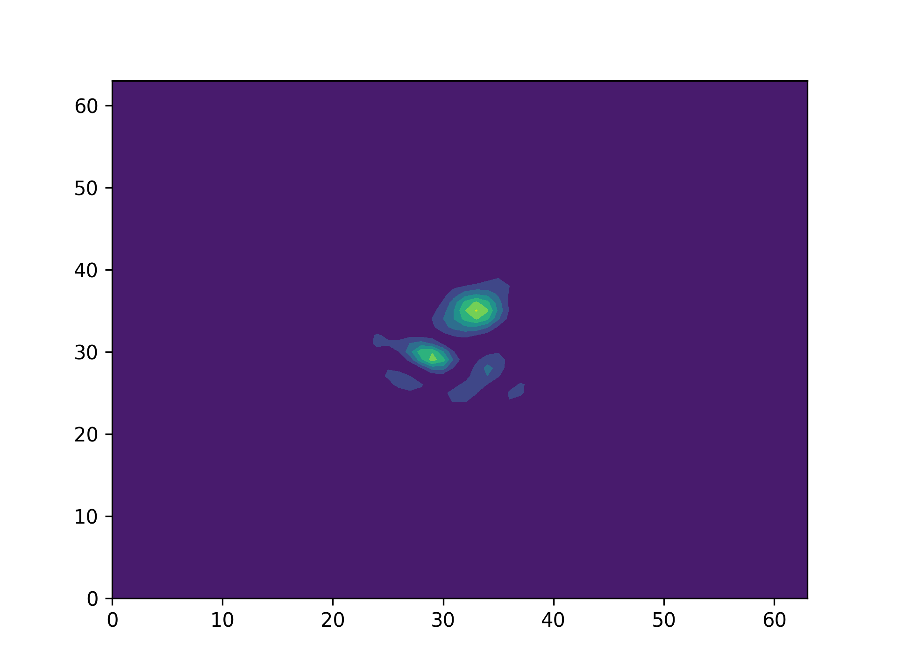
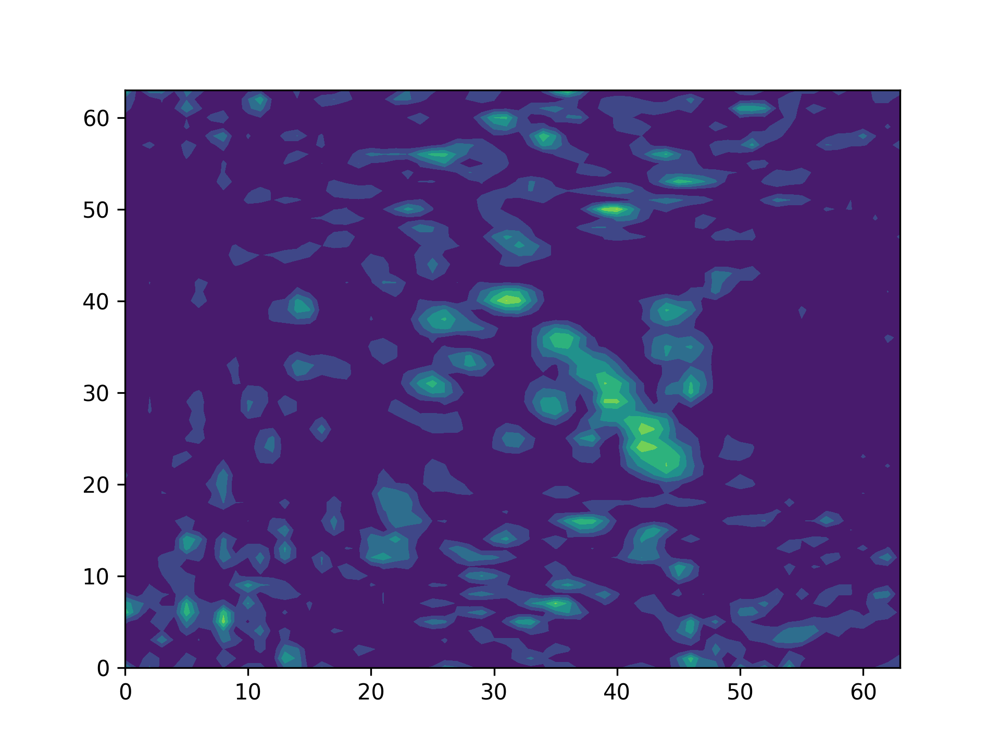

# Light 程序正确性检测
## 文件夹说明

本文件夹致力于对光束远场传输模拟程序（Light）的正确性进行检测。其中，fortran文件夹内为使用其他光束远场传输模拟程序生成的对照数据。将Light程序生成的数据与对照数据对比验证Light程序的正确性。

## 结果展示
Light程序模拟的远场光强：
  

  
对照远场光强：
  

两者之间的相对误差：`16.08617316762031`

---
---
## 运行方法
Light程序模拟的远场光强：

#### step1：Light程序生成远场
运行命令`bash test64.sh`。注意检查`INPUT.txt`文件中的`aznk_dir`确认其与本文件夹中的`zernike_220624_2_35_10000.dat`地址保持一致。
#### step2：对比Light程序生成的远场和对照远场
运行命令`python datatest.py`。[得到结果](#结果展示)

  
  